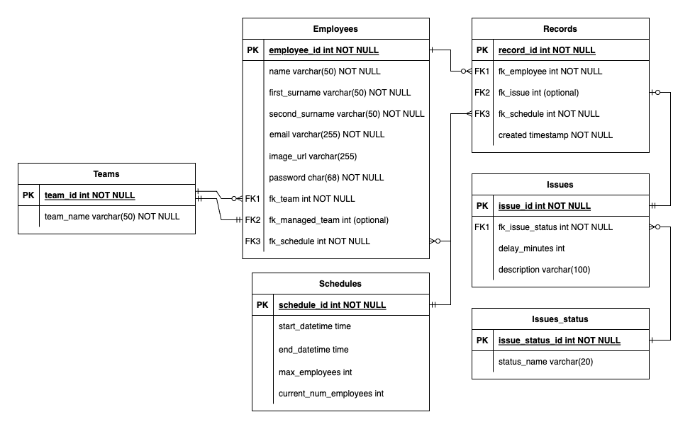
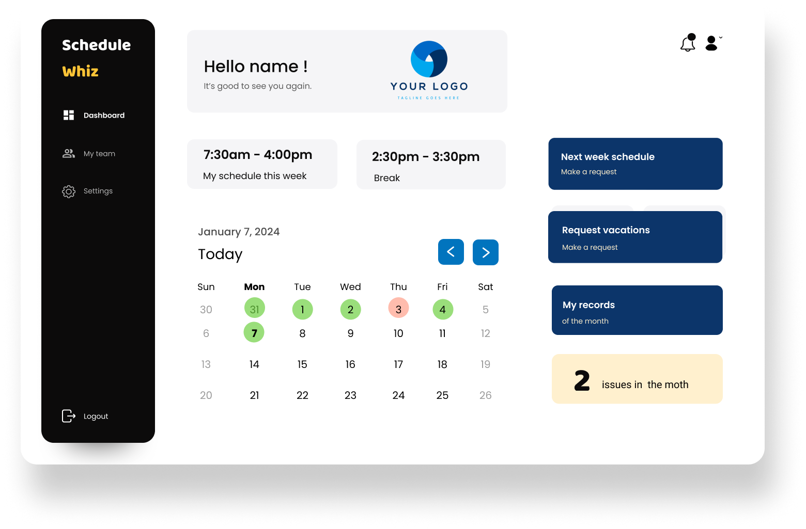
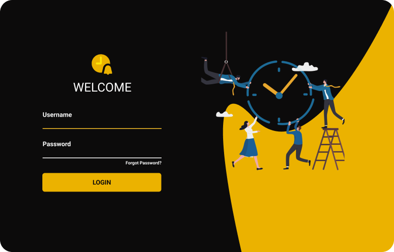
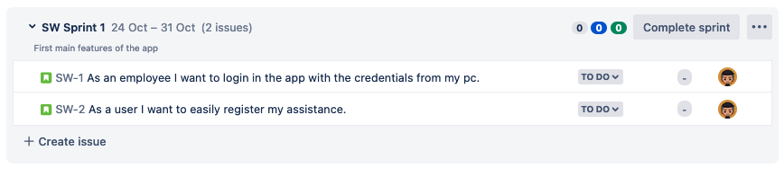
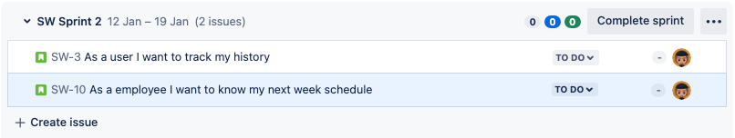

# Schedule Whiz

Progressive Schedule Optimization

## Project Description

The Progressive Schedule Optimization project is aimed at designing an assistance system to help teams find the best schedule in flexible and remote work environments. This Spring Boot Java application will guide you through the process of optimizing schedules for teams in dynamic work settings.

## Backlog

You can find the project's backlog in the [Backlog](./images/backlog.png) image.

## Database Design

The database schema for this project can be found in the [Database Design](./images/database-design.png) image.

## User Interface Mockup

Here is a mockup of the user interface:

### Dashboard

### Login

## Sprint 1 (MVP part 1)

- [x] As an employee I want to login in the app with the credentials from my pc.
- [x] As a user I want to easily register my assistance.

## Sprint 2 (MVP part 2)

- [ ] As a user I want to track my history.
- [ ] As a employee I want to know my next week schedule.

## Getting Started

To get started with this project, follow these steps:

1. Clone the repository.
2. Setup the database with the provided DDL in `/scripts` folder (PostgreSQL).
3. Configure your database settings in `application.properties` and `env.properties` (see `env.properties.example`).
4. Run the Spring Boot application.
5. Access the application through a web browser.
6. Begin optimizing schedules for your team!

## Prerequisites

- Java JDK
- Spring Boot
- MySQL/PostgreSQL/your preferred database

## Contributing

Contributions are welcome! Please follow the [Contributing Guidelines](CONTRIBUTING.md).

## Task List

- [x] Initialize the Spring Boot project.
- [x] Create the database schema.
- [x] Implement user authentication.
- [ ] Design the scheduling algorithm.
- [x] Develop the user interface.
- [ ] Integrate flexibility and remote work features.
- [ ] Test and optimize the system.
- [ ] Document the project.
- [ ] Deployment and production-ready setup.

## License

This project is licensed under the [MIT License](LICENSE).
